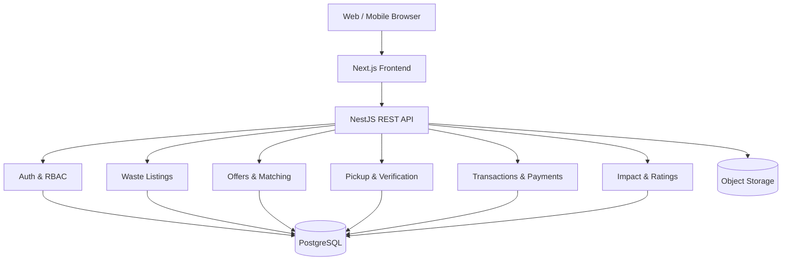

# ABAH-junpro

Created by:
1. Akhnaf Fawzan Yogatrisna - 24/536720/TK/59561 - Software Architect
2. Akmal Rafli Fauzan - 24/533033/TK/59053 - Backend Developer
3. Rafi Busthami - 24/532760/TK/58998 - Frontend Developer

## 🤝 Contribution Guidelines

To maintain code quality and a smooth workflow, please follow all of these rules.

### Branching Strategy

| Type       | Description             |
| :--------- | :---------------------- |
| `feature/` | For adding new features |
| `fixing/`  | For bug fixes           |

**Pattern:** `<type>/<role>.<your_name>`  
_Example:_ `feature/be.akmal`

---

### Commit Message Rules

We follow a simplified [Conventional Commits](https://www.conventionalcommits.org/) pattern.

**Pattern:** `<type>(<scope>): <short_summary>`

| Type       | Description                               |
| :--------- | :---------------------------------------- |
| `feat`     | New feature                               |
| `fix`      | Bug fix                                   |
| `docs`     | Documentation changes                     |
| `style`    | Layout/styling changes                    |
| `refactor` | Code restructuring without feature change |

---

### Pull Request & Review

1. Push your branch to remote repository.
2. Open a Pull Request targeting the `main` branch.
3. Add a clear description of the changes made.
4. Request review from at least one teammate before merging.

---

# ABAH — Project Guide

A local circular-waste digital platform that connects waste generators with collectors and processors, turning separated waste into traceable material resources.

---

## 1. Project Description

### Problem & Direction

ABAH is a digital platform for managing and distributing sorted waste. It helps households, offices, restaurants, schools, and small businesses offer recyclable materials such as cardboard, paper, PET bottles, cans, glass, and used cooking oil.

Collectors, waste banks, recycling facilities, and community organizations can discover available materials, accept pickup requests, make offers, and record the actual weight collected. The platform provides a clearer path from waste source to processor instead of treating every item as ordinary trash.

**Core Value Proposition:** ABAH makes waste separation, pickup coordination, weight verification, payment, and impact reporting easier in one place.

---

## 2. Core Features (MVP Scope)

1. **Accounts and Roles:** Register as a waste generator, collector, processor, or community partner. A user may hold more than one role.
2. **Waste Listing:** Create a listing with material type, estimated weight, condition, photos, location, availability, and sale or donation preference.
3. **Search and Matching:** Filter by material, distance, minimum volume, condition, and pickup schedule. Match supply with processor demand.
4. **Offers and Negotiation:** Collectors can propose a price, pickup fee, and schedule. Both sides can accept, reject, or counter an offer.
5. **Pickup Scheduling:** Book a pickup window and track statuses (`requested`, `accepted`, `on the way`, `collected`, `verified`, `completed`).
6. **Weight Verification:** Record estimated versus actual weight, upload a scale photo, and calculate the final transaction value.
7. **Payment and History:** Store transaction totals, payment status, receipts, cancellations, and a complete history for each user.
8. **Ratings and Impact:** Rate reliability and material quality. Show kilograms collected, material categories, and estimated waste diverted.

---

## 3. System Architecture

ABAH uses a **Modular Monolith** architecture for the MVP to reduce deployment complexity while keeping clean boundaries to split into microservices later if the platform grows.

## Frontend

### Responsibilities
- Develop the user interface
- Create responsive layouts
- Implement user interactions
- Integrate frontend pages with APIs

### Tech Stack
- HTML
- CSS
- JavaScript
